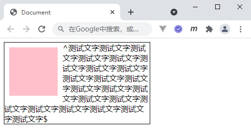
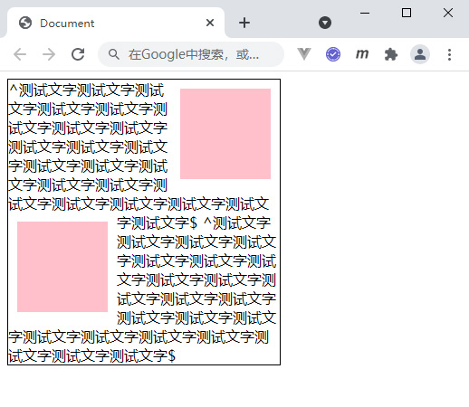
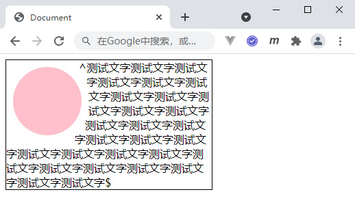
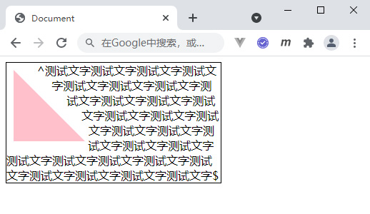
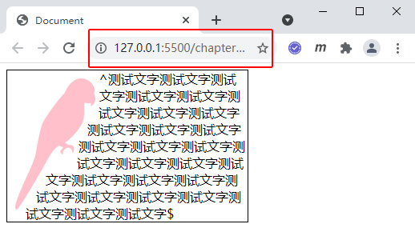
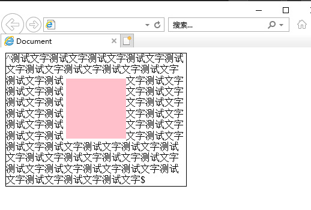

# 文字环绕布局

## 利用 float 浮动实现文字环绕

&emsp;&emsp;假设在一个布局中有上下两个元素，如果给上面的元素添加 float 浮动，会使其脱离文档流，从而让下面元素跑到上面元素的后面。

&emsp;&emsp;但是如果下面元素是一段文本的话，那么将无法跑到上面元素的后面，而是会产生文字环绕的效果。为什么会这样呢？主要是因为最初设计的初衷就是为了实现这种文字环绕的效果。

```html
<style>
  .main {
    width: 300px;
    border: 1px black solid;
  }
  .box {
    width: 100px;
    height: 100px;
    background: pink;
    float: left;
    margin: 10px;
  }
</style>
<div class="main">
  <div class="box"></div>
  ^测试文字测试文字测试文字测试文字测试文字测试文字测试文字测试文字测试文字测试文字测试文字测试文字测试文字测试文字测试文字测试文字测试文字测试文字测试文字测试文字测试文字测试文字$
</div>
```

<div align=center>
	
    <div>float浮动的文字环绕</div>
</div>

&emsp;&emsp;左浮动会产生右环绕，同理右浮动会产生左环绕。但是同时出现左右环绕，目前 float 属性还做不到，将来 float 属性可能会添加一个 center 值，专门用来实现左右文字环绕的需求。

&emsp;&emsp;当然我们可以分别实现对文字的左右环绕方式，代码如下：

```html
<style>
  .main {
    width: 300px;
    border: 1px black solid;
  }
  .box1,
  .box2 {
    width: 100px;
    height: 100px;
    background: pink;
    float: right;
    margin: 10px;
  }
  .box2 {
    float: left;
  }
</style>
<div class="main">
  <div class="box1"></div>
  ^测试文字测试文字测试文字测试文字测试文字测试文字测试文字测试文字测试文字测试文字测试文字测试文字测试文字测试文字测试文字测试文字测试文字测试文字测试文字测试文字测试文字测试文字$
  <div class="box2"></div>
  ^测试文字测试文字测试文字测试文字测试文字测试文字测试文字测试文字测试文字测试文字测试文字测试文字测试文字测试文字测试文字测试文字测试文字测试文字测试文字测试文字测试文字测试文字$
</div>
```

<div align=center>
	
    <div>float浮动的文字环绕</div>
</div>

## 利用 CSS Shapes 模块实现文字环绕

&emsp;&emsp;CSS Shapes 是一个 CSS 模块，用于定义几何形状。CSS Shapes 模块可以实现不规则的文字环绕效果，需要和浮动配合使用。

```html
<style>
  .main {
    width: 300px;
    border: 1px black solid;
  }
  .box {
    width: 100px;
    height: 100px;
    background: pink;
    float: left;
    margin: 10px;
    border-radius: 50%;
    shape-outside: margin-box;
  }
</style>
<div class="main">
  <div class="box"></div>
  ^测试文字测试文字测试文字测试文字测试文字测试文字测试文字测试文字测试文字测试文字测试文字测试文字测试文字测试文字测试文字测试文字测试文字测试文字测试文字测试文字测试文字测试文字测试文字测试文字测试文字测试文字测试文字测试文字$
</div>
```

<div align=center>
	
    <div>CSS Shapes的文字环绕</div>
</div>

&emsp;&emsp;可以看到文字会围绕这圆形的边界进行环绕，而普通的 float 浮动环绕是做不到的。`shape-outside`的可选值比较多：

- **none** : 默认值
- **shape-box** : 图形盒子，例如：margin-box、border-box、padding-box、content-box
- **basic-shape** : 基本图形函数，例如：circle()、ellipse()、polygon()
- **image** : 图像类

&emsp;&emsp;margin-box 就是沿着元素 margin 区域进行环绕，border-box 就是沿着元素 border 区域进行环绕。基本图形函数 circle()就是沿着圆形区域进行环绕、ellipse()就是沿着椭圆形区域进行环绕、polygon()就是沿着自定义的折线区域进行环绕，下面是结合 clip-path 属性（使用裁剪方式创建元素的可显示区域）完成的一个围绕三角形区域进行的文字环绕。

```css
.box {
  width: 100px;
  height: 100px;
  background: pink;
  float: left;
  margin: 10px;
  clip-path: polygon(0 0, 0 100px, 100px 100px);
  shape-outside: polygon(0 0, 0 100px, 100px 100px);
  shape-margin: 15px;
}
```

<div align=center>
	
    <div>CSS Shapes的文字环绕</div>
</div>

&emsp;&emsp;还可以让文字环绕特殊图片，需要配合 mask 属性（遮罩）完成，而且需要在服务器环境下运行代码，因为图片的访问有浏览器的安全限制。

```css
.box {
  width: 100px;
  height: 164px;
  float: left;
  margin: 10px;
  shape-outside: url(./birds.png);
  shape-margin: 5px;
  background-color: pink;
  -webkit-mask: url(./birds.png) no-repeat;
  mask: url(./birds.png) no-repeat;
}
```

<div align=center>
	
    <div>CSS Shapes的文字环绕</div>
</div>

## 利用 CSS Exclusion 模块实现文字环绕

&emsp;&emsp;CSS Exclusion 是 Adob​​e 的另一项提议，旨在扩展 CSS 的现有可能性（以避免浮动的限制），并能够构建允许内联内容流入和/或围绕圆形或其他任意复杂形状的布局。

&emsp;&emsp;利用 CSS Exclusion 模块可以实现类似于 Word 文档的方式，可以让文字四周环绕元素，不过 CSS Exclusion 模块目前浏览器的支持程度还不高，只能针对 IE10+的浏览器起作用。

&emsp;&emsp;CSS Exclusion 模块主要使用 wrap-flow 属性，可选值有：start、end、both、clear 等。

```html
<style>
  .main {
    width: 300px;
    border: 1px black solid;
    position: relative;
  }
  .box {
    width: 100px;
    height: 100px;
    background-color: pink;
    position: absolute;
    left: 50%;
    top: 50%;
    margin: -50px;
    -ms-wrap-flow: both;
    -webkit-wrap-flow: both;
  }
</style>
<div class="main">
  <div class="box"></div>
  ^测试文字测试文字测试文字测试文字测试文字测试文字测试文字测试文字测试文字测试文字测试文字测试文字测试文字测试文字测试文字测试文字测试文字测试文字测试文字测试文字测试文字测试文字测试文字测试文字测试文字测试文字测试文字测试文字测试文字测试文字测试文字测试文字测试文字测试文字测试文字测试文字测试文字测试文字测试文字测试文字测试文字测试文字测试文字测试文字$
</div>
```

<div align=center>
	
    <div>CSS Exclusion在IE11下的文字环绕</div>
</div>
